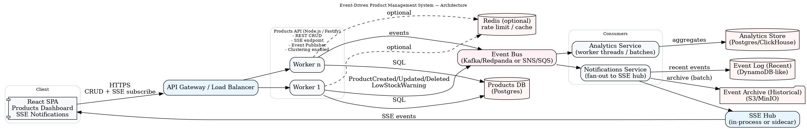
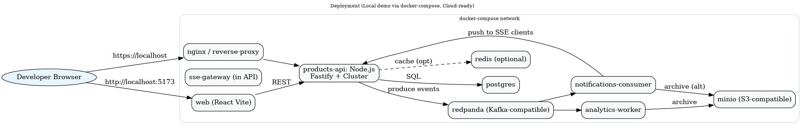

# Prompt (2025-09-05 11:30)
I’m working on a demo product management platform and I’d like your help shaping it so it’s clear, demo-ready, and good for walking through in an interview. Here’s what I have in mind:

Tech stack: Node.js with Fastify (REST API), clustering enabled, plus Server-Sent Events (SSE) for notifications.

Storage/Eventing: Products stored in Postgres. Events go through Kafka/Redpanda locally, or SNS/SQS in the cloud.

Consumers:

A Notifications service that fans events out to SSE clients.

An Analytics service that can use worker threads for processing.

Event log: Recent events stored in a DynamoDB-like store, with older ones archived into S3/MinIO.

UI: A minimal React SPA for CRUD operations, plus live low-stock alerts.

Constraints: Keep it simple and clear for demo purposes. Eventual consistency for events is fine. Target throughput ~10k requests/sec.

What I’d like you to produce:

Architecture diagram (C4 component level): show client, API, Postgres, event bus, consumers, SSE hub, and storage flows.

Deployment diagram for a local docker-compose setup that’s cloud-ready. Please call out the images/services.

Event contract definitions: JSON Schemas for ProductCreated, ProductUpdated, ProductDeleted, and LowStockWarning. Include a shared product definition and an envelope schema, with type constrained per event.

Review criteria:

It should be easy to explain in a live interview walkthrough.

Clear traceability to the OpenAPI spec (/events/stream, CRUD endpoints).

Show scalability considerations (clustering, open handles, backpressure).

Keep it simple — avoid over-engineering. Names and flows should stay straightforward.

Output format:

PNGs for both diagrams.

JSON Schema files for each event + shared envelope + product definition.

